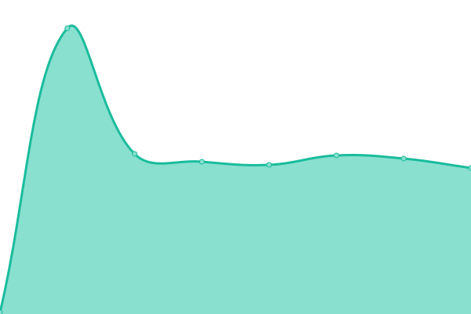
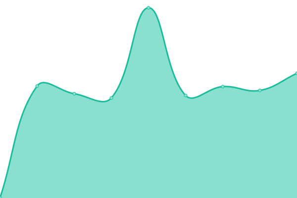
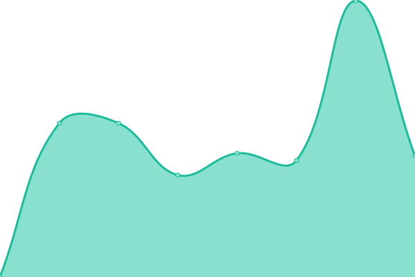
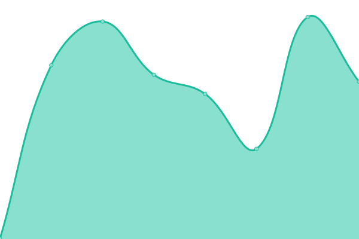

# [📈 Live Status](https://demo.upptime.js.org): <!--live status--> **🟩 All systems operational**

This repository contains the open-source uptime monitor and status page for [immoreel](https://demo.upptime.js.org), powered by [Upptime](https://github.com/upptime/upptime).

With [Upptime](https://upptime.js.org), you can get your own unlimited and free uptime monitor and status page, powered entirely by a GitHub repository. We use [Issues](https://github.com/immoreel/upptime/issues) as incident reports, [Actions](https://github.com/immoreel/upptime/actions) as uptime monitors, and [Pages](https://demo.upptime.js.org) for the status page.

<!--start: status pages-->
<!-- This summary is generated by Upptime (https://github.com/upptime/upptime) -->
<!-- Do not edit this manually, your changes will be overwritten -->
<!-- prettier-ignore -->
| URL | Status | History | Response Time | Uptime |
| --- | ------ | ------- | ------------- | ------ |
|  [Google](https://www.google.com) | 🟩 Up | [google.yml](https://github.com/immoreel/upptime/commits/HEAD/history/google.yml) | 

 100ms
     
 | 

<a href="https://immoreel.github.io/upptime/history/google">100.00%</a>
    

|  [COA](https://www.coa.nl/nl) | 🟩 Up | [coa.yml](https://github.com/immoreel/upptime/commits/HEAD/history/coa.yml) | 

 2129ms
     
 | 

<a href="https://immoreel.github.io/upptime/history/coa">98.74%</a>
    

|  [Kamp Woudenberg](https://www.kampwoudenberg.nl) | 🟩 Up | [kamp-woudenberg.yml](https://github.com/immoreel/upptime/commits/HEAD/history/kamp-woudenberg.yml) | 

 875ms
     
 | 

<a href="https://immoreel.github.io/upptime/history/kamp-woudenberg">100.00%</a>
    

|  [The Good Hairclub](https://thegoodhairclub.nl) | 🟩 Up | [the-good-hairclub.yml](https://github.com/immoreel/upptime/commits/HEAD/history/the-good-hairclub.yml) | 

 1296ms
     
 | 

<a href="https://immoreel.github.io/upptime/history/the-good-hairclub">100.00%</a>
    

|  [PKN Ontmoetingskerk Wilnis](https://pknontmoetingskerkwilnis.nl) | 🟩 Up | [pkn-ontmoetingskerk-wilnis.yml](https://github.com/immoreel/upptime/commits/HEAD/history/pkn-ontmoetingskerk-wilnis.yml) | 

 1633ms
     
 | 

<a href="https://immoreel.github.io/upptime/history/pkn-ontmoetingskerk-wilnis">100.00%</a>
    

|  [MyCOA](https://www.mycoa.nl/nl) | 🟩 Up | [my-coa.yml](https://github.com/immoreel/upptime/commits/HEAD/history/my-coa.yml) | 

 607ms
     
 | 

<a href="https://immoreel.github.io/upptime/history/my-coa">100.00%</a>
    

<!--end: status pages-->

[**Visit our status website →**](https://demo.upptime.js.org)

## 📄 License

- Powered by: [Upptime](https://github.com/upptime/upptime)
- Code: [MIT](./LICENSE) © [Anand Chowdhary](https://anandchowdhary.com), supported by [Pabio](https://pabio.com)
- Data in the `./history` directory: [Open Database License](https://opendatacommons.org/licenses/odbl/1-0/)
